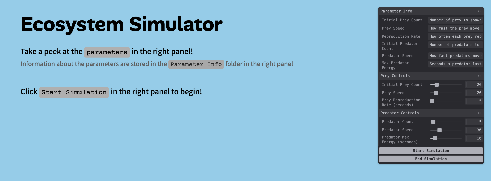
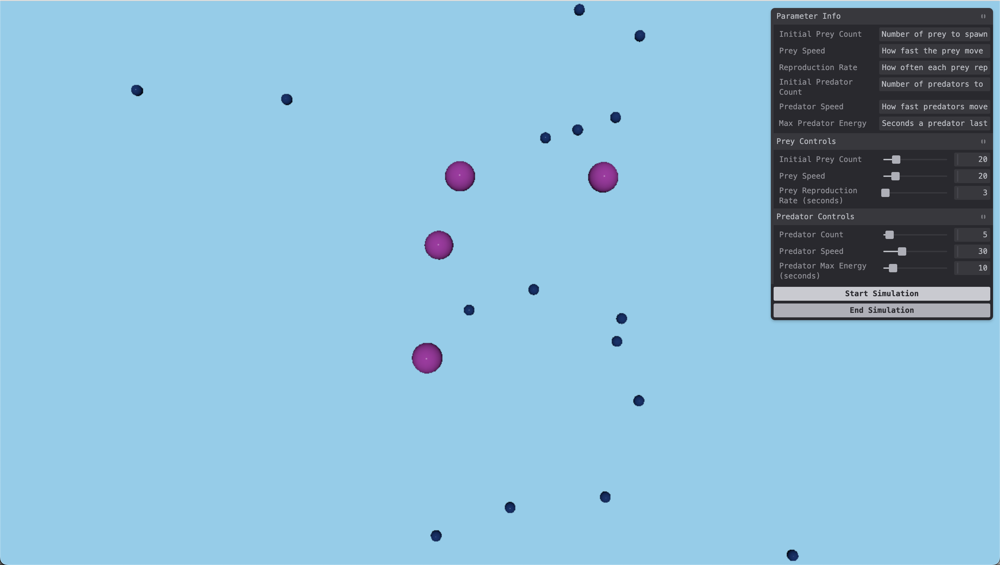
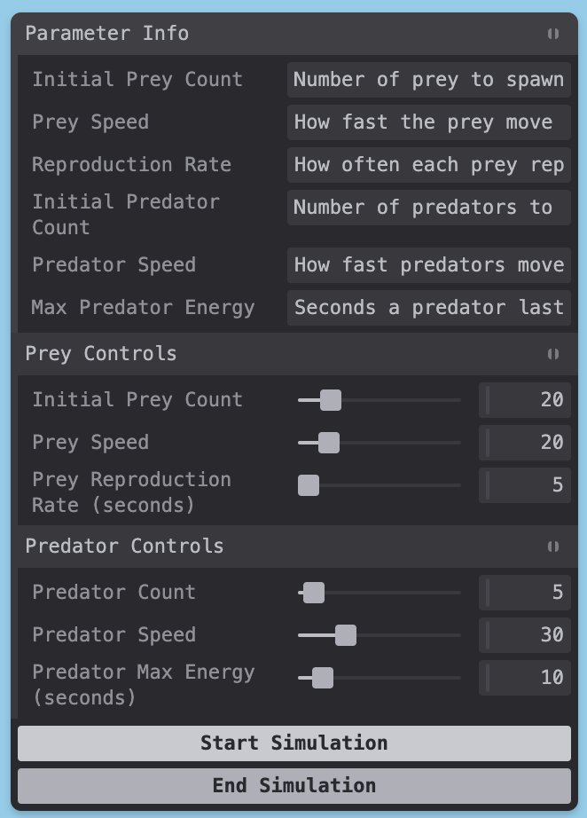

## Ecosystem Simulator
Arianna Xie 
https://a4-ariannaxie.onrender.com/

The goal of this project is to simulate a simple ecosystem with just predators and prey. Predators (large, pink spheres) chase the prey (small, dark blue spheres) closest to them. Prey move randomly until they come close to a predator. In that case, they run away. Predators gain energy from consuming prey. When they run out of energy, they die. Predators also shrink in size as they "starve." On the other hand, prey can reproduce after a set time.

The parameters to this simulation are:
- Initial Prey Count: the number of prey initally spawned
- Prey Speed: the speed at which prey move
- Prey Reproduction Rate: how often each prey can reproduce (in seconds)
- Predator Count: the number of predators
- Predator Speed: the speed at which predators move
- Predator Max Energy: the amount of time (in seconds) predators have to find prey

Note on AI Use: I used ChatGPT to debug problems I faced like the "prey" not moving as anticipated or the "prey" not reproducing according to real time.

Main Challenge: Since there's so much information in Three.js's documentation, I had to Google a lot of what I wanted to do and see if anything came up that could help. 
For example, I had to Google things like how to set a random position for an object, how to move towards another object, how to add random movements to objects, how to integrate a GUI, how to add buttons to the GUI, and a lot more. From there, I would look at the documentation for specific functions that would come up to understand them.
Also, since I had to work a lot with vectors to set the direction and movement of the prey and predators, I had to refresh my mind on concepts like normalization.