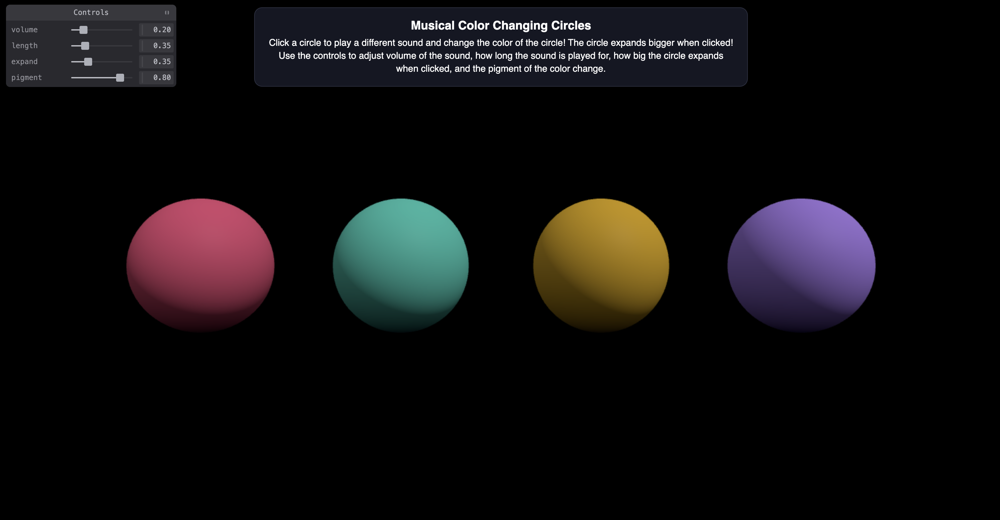

Assignment 4 - Creative Coding: Interactive Multimedia Experiences
===

## Musical Color Changing Circles
Grace Robinson

Hosting link: http://a4-grace-robinson.onrender.com

Include a very brief summary of your project here:

This application uses Three.js to create the 3D shapes and Web Audio API to create the audio. This application does use a server created using Express. There is also an area on the page that allows the user to interact with to change different parameters. The user is able to adjust volume of the sound, how long the sound is played for, how big the circle expands when clicked, and the pigment of the color change. The goal of this application was to create musical color changing circles like a fun and qunique instrument. To make interacting with the circles more fun, I made them change color each time they were clicked. Some of the challenges that I faced when realizing the application were trying to figure out how to make it so that when a 3D circle was clicked, sound would play because I had to combine the 3D shapes and Web Audio API. However, I will say that the tutorials really helped me figure out how to approach everything. The instructions that I included on the page of the application are: Click a circle to play a different sound and change the color of the circle! The circle expands bigger when clicked! Use the controls to adjust volume of the sound, how long the sound is played for, how big the circle expands when clicked, and the pigment of the color change. By the pigment of the color change, I mean that when you change the pigment control higher or lower and then press a circle to change then that change is reflected, however just changing the pigment control higher or lower does not change the pigment of the color unless the user clicks the circle. On the control pane, the volume adjust volume of the sound, the length changes how long the sound is played for, the expand changes how big the circle expands when clicked, and the pigment changes the pigment of the color change when the circle is clicked.

Image of the index page:

